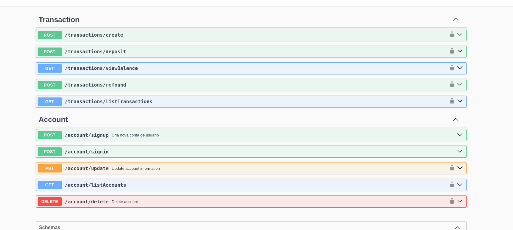
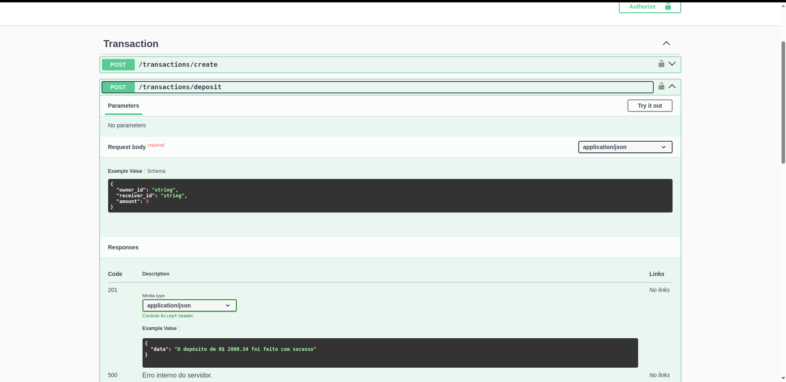

# Projeto Banco API

Este projeto é uma API desenvolvida utilizando o framework **NestJS**, que implementa uma aplicação para gerenciamento de tarefas (**Banco**). A API utiliza autenticação JWT para proteger os endpoints e está documentada com **Swagger** para facilitar a interação e compreensão.

---

## **Configuração Inicial**

Antes de iniciar o projeto, certifique-se de ter instalado:

- **Node.js** (versão 18 ou superior)
- **Docker** e **Docker Compose**

### 1. **Configurar Variáveis de Ambiente**

Crie um arquivo `.env` na raiz do projeto com as seguintes variáveis (ajuste conforme necessário):

```env
# Conexão com o Banco de Dados e configuração do jwt token
passar no .env

DB_HOST=localhost
DB_PORT=5432
DB_USER=admin
DB_PASSWORD=admin
DB_NAME=banco

SECRET_KEY="secretkey"
```

### 2. **Rodar Projeto**

Execute o comando para compilar a aplicação:

```sh
npm run build
```

### 3. **Construir e Rodar a Imagem Docker**

Para construir a imagem Docker sem utilizar cache, execute:

```sh
docker build --no-cache -t bancoapi_api .
```

Após a construção, suba os serviços com o Docker Compose:

```sh
docker compose up -d
```

### 🛠 **Uso**

#### **Documentação da API**

A documentação interativa da API está disponível no Swagger. Após inicializar o projeto, acesse:

[http://localhost:3000/docs](http://localhost:3000/docs)

#### **Rodar em Ambiente de Desenvolvimento**

```sh
npm run start:dev
```

#### **Rodar Testes**

```sh
npm run test
```

#### **Linter e Formatação**

```sh
npm run lint
npm run format
```

#### **Encerrando os Serviços**

Para parar os serviços Docker, execute:

```sh
docker compose down
```

---

## **Tecnologias Utilizadas**

- NestJS
- PostgreSQL
- TypeScript
- Swagger
- Docker
- RabbitMQ

---

## **Sobre o Projeto**

Este projeto foi desenvolvido para demonstrar habilidades com:

- Arquitetura Modular no NestJS.
- Implementação de Autenticação JWT.
- Configuração de um ambiente completo usando Docker.
- Documentação clara e interativa com Swagger.
- Gerenciamento de filas com RabbitMQ.

---


## **Rotas da API**

| Método   | Endpoint | Descrição           |
| -------- | -------- | ------------------- |
| `GET`    | `/transactions/listTransactions`      | *Rota para listar transação ja feitas* |
| `POST`   | `/transactions/deposit`      | *Depositar saldo na propria conta sem limites, propositalmente criado para simular mais de um tipo de transacao* |
| `POST`    | `/transactions/refound`      | *Transferir um valor para um outro usuario* |
| `POST` | `/transactions/refound`      | *Pedir reembolso para transação pending ou success que nao passaram do prazo de 1 dia.* |




